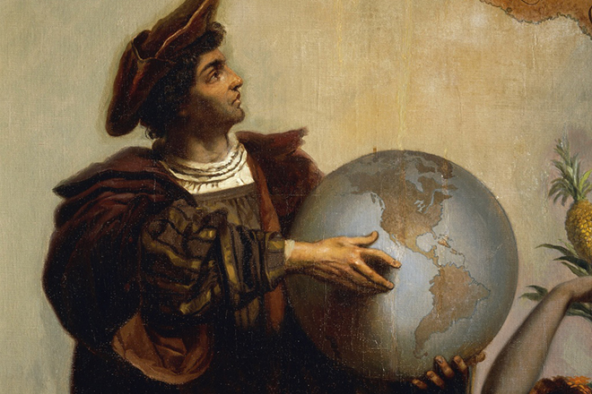

> Христофор Колумб – средневековый мореплаватель, открывший Саргассово и Карибское моря, Антильские, Багамские острова и Американский континент для европейцев, первым из известных путешественников, переплывший Атлантический океан.

>По разным свидетельствам, Христофор Колумб родился в 1451 году в Генуе, на территории нынешней Корсики. Шесть итальянских и испанских городов претендуют на право зваться его родиной. О детстве и юности мореплавателя достоверно неизвестно практически ничего, так же смутно и происхождение семейства Колумбов.

>Некоторые исследователи называют Колумба итальянцем, другие считают, что его родители были крещеными евреями, марранами. Это предположение объясняет невероятный по тем временам уровень образования, которое получил Христофор, выходец из семьи обычного ткача и домохозяйки.

>Согласно некоторым историкам и биографам, Колумб до 14 лет учился на дому, при этом имел блестящие познания в математике, знал несколько языков, включая латынь. У мальчика было три младших брата и сестра, и все они обучались приходящими учителями. Один из братьев, Джованни, умер еще в детстве, сестра Бьянкелла выросла и вышла замуж, а Бартоломео и Джакомо сопровождали Колумба в его странствиях.

>Скорее всего, Колумбам посильную помощь оказывали собратья по вере, богатые генуэзские финансисты из марранов. С их помощью юноша из небогатой семьи попал в университет города Падуя. 

